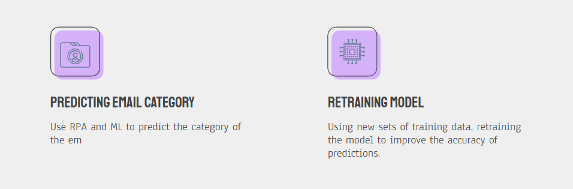
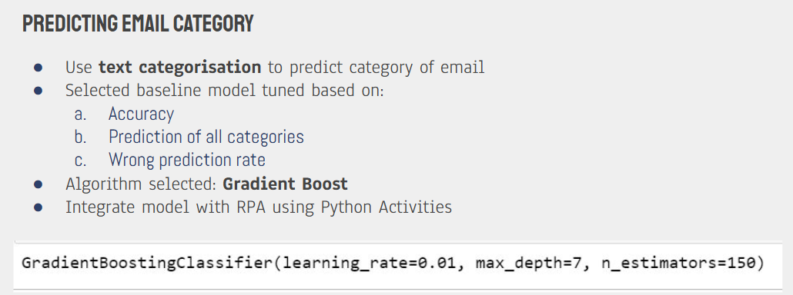
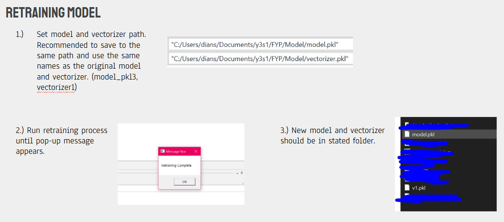
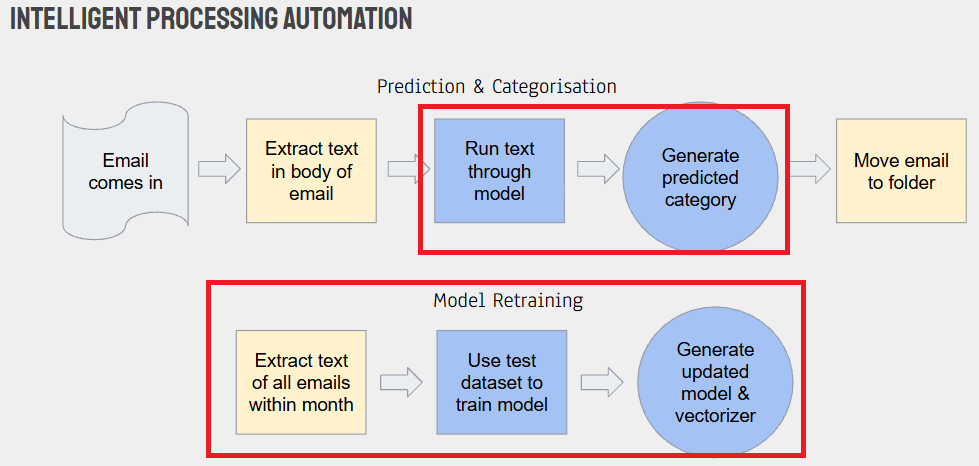
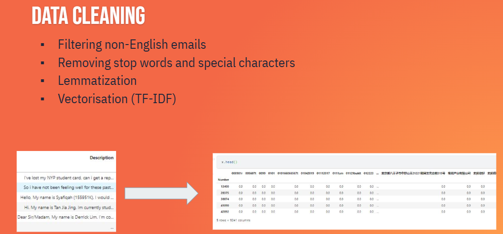
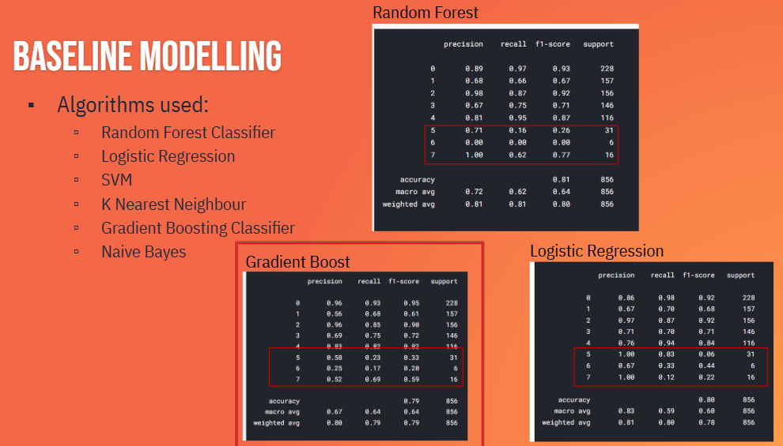
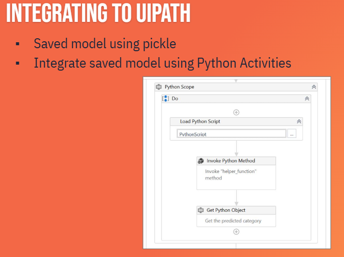

# Email_Category_Prediction_Automation

NOTE: This repository contains my portion of a 3-Person project. This project was my earliest automation project and thus, I was not familiar with GitHub and version control at that time. Due to upload size constraints, the UiPath files itself have been zipped.

## Background
This project aimed to automate the categorisation of incoming emails by using machine learning to predict each email's category based on its content, allowing messages to be routed more efficiently within Outlook using UiPath. 

## My Portion
I was responsible for developing the model with Python for the prediction of the category through Text Categorisation, and integrating the model to UiPath. During the baseline modelling stage, several classification models were trained using their default settingss to compare their initial performance. The best performing model based on accuracy, precision, and recall was then selected for hyperparameter tuning using Optuna. The final tuned model was used to the produce the project's final evaluation score of about 0.80.

To further improve the model, I created a flow that would retrain the model based on new emails as its training source. 

## Overall Project's Flow 
The following is the final flow of the whole group project, with my portion indicated in red.

## Process

